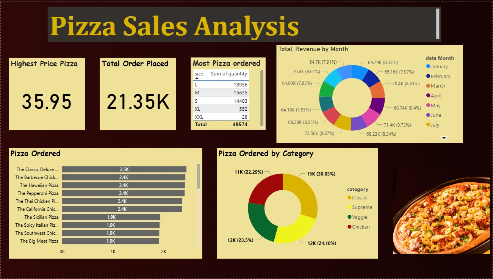

# 🍕 Pizza Sales Analysis using AWS S3, Snowflake & Power BI

## 📌 Project Overview

This project is an end-to-end cloud-based data analytics solution built using AWS S3, Snowflake, SQL, and Power BI.  
The project analyzes pizza sales data to uncover valuable business insights such as:

- Best-selling pizzas
- Monthly revenue trends
- Most ordered pizza size
- Category-wise sales analysis
- Total orders placed
- Revenue analysis

The dashboard helps businesses understand customer ordering behavior and improve sales decisions through interactive visualizations.

---

# 🏗️ Project Architecture

```text
CSV Files
   ↓
AWS S3 Bucket
   ↓
Snowflake Data Warehouse
   ↓
SQL Analysis
   ↓
Power BI Dashboard
```

---

# 🛠️ Tech Stack

| Technology | Purpose |
|---|---|
| AWS S3 | Cloud Storage |
| Snowflake | Data Warehouse |
| SQL | Data Analysis |
| Power BI | Dashboard & Visualization |
| GitHub | Version Control |

---

# 📂 Dataset Tables

The project uses 4 datasets:

| Table Name | Description |
|---|---|
| orders | Stores order date & time |
| order_details | Stores quantity ordered |
| pizzas | Stores pizza price & size |
| pizza_types | Stores pizza category & ingredients |

---

# 📊 Dashboard Preview

> Add your dashboard screenshot inside the `screenshots/` folder and update the image path below.

md



---

# 📈 Business Questions & SQL Queries

---

## 1️⃣ Which pizza has the highest price?

```sql
SELECT pt.name AS pizza_name,
MAX(p.price) AS highest_price
FROM pizzas p
JOIN pizza_types pt
ON p.pizza_type_id = pt.pizza_type_id
GROUP BY pt.name
ORDER BY highest_price DESC
LIMIT 1;
```

---

## 2️⃣ How many total orders were placed?

```sql
SELECT COUNT(DISTINCT order_id) AS total_orders
FROM orders;
```

---

## 3️⃣ Which pizza size is ordered most?

```sql
SELECT p.size,
SUM(od.quantity) AS total_quantity
FROM order_details od
JOIN pizzas p
ON od.pizza_id = p.pizza_id
GROUP BY p.size
ORDER BY total_quantity DESC;
```

---

## 4️⃣ Which category sells the most?

```sql
SELECT pt.category,
SUM(od.quantity) AS total_quantity
FROM order_details od
JOIN pizzas p
ON od.pizza_id = p.pizza_id
JOIN pizza_types pt
ON p.pizza_type_id = pt.pizza_type_id
GROUP BY pt.category
ORDER BY total_quantity DESC;
```

---

## 5️⃣ How much revenue is generated every month?

```sql
SELECT CASE MONTH(TO_DATE(o.order_date,'DD-MM-YYYY'))
WHEN 1 THEN 'January'
WHEN 2 THEN 'February'
WHEN 3 THEN 'March'
WHEN 4 THEN 'April'
WHEN 5 THEN 'May'
WHEN 6 THEN 'June'
WHEN 7 THEN 'July'
WHEN 8 THEN 'August'
WHEN 9 THEN 'September'
WHEN 10 THEN 'October'
WHEN 11 THEN 'November'
WHEN 12 THEN 'December'
END AS month_name,

ROUND(SUM(od.quantity * p.price),2) AS total_revenue

FROM orders o

JOIN order_details od
ON o.order_id = od.order_id

JOIN pizzas p
ON od.pizza_id = p.pizza_id

GROUP BY MONTH(TO_DATE(o.order_date,'DD-MM-YYYY'))

ORDER BY MONTH(TO_DATE(o.order_date,'DD-MM-YYYY'));
```

---

## 6️⃣ Which pizzas are ordered most?

```sql
SELECT pt.name AS pizza_name,
SUM(od.quantity) AS total_quantity

FROM order_details od

JOIN pizzas p
ON od.pizza_id = p.pizza_id

JOIN pizza_types pt
ON p.pizza_type_id = pt.pizza_type_id

GROUP BY pt.name

ORDER BY total_quantity DESC
LIMIT 10;
```

---

# 📌 Key Insights

- Large-sized pizzas are ordered the most.
- Classic pizza category generates the highest sales.
- Revenue trends vary monthly.
- Certain pizzas contribute significantly to total revenue.
- Sales patterns help optimize business strategies.

---

# 📊 Power BI Dashboard Features

- KPI Cards
- Monthly Revenue Analysis
- Top Selling Pizzas
- Category-wise Sales
- Pizza Size Analysis
- Interactive Filters & Slicers

---

# 🚀 How to Run the Project

## 1️⃣ Upload CSV Files to AWS S3

Upload:
- orders_csv.csv
- order_details_csv.csv
- pizzas_csv.csv
- pizza_types_csv.csv

---

## 2️⃣ Load Data into Snowflake

Create:
- Database
- Schema
- Tables
- Stage

Load files using:

```sql
COPY INTO table_name
FROM @stage_name/file_name.csv;
```

---

## 3️⃣ Run SQL Queries

Execute all SQL analysis queries in Snowflake Worksheets.

---

## 4️⃣ Connect Snowflake to Power BI

In Power BI:

```text
Get Data → Snowflake
```

Connect using:
- Server
- Warehouse
- Database

---

## 5️⃣ Build Dashboard

Create:
- KPI Cards
- Donut Charts
- Bar Charts
- Line Charts

---

# 📁 Project Structure

```text
pizza-sales-analysis/
│
├── dataset/
│
├── sql/
│   ├── create_tables.sql
│   ├── load_data.sql
│   └── analysis_queries.sql
│
├── dashboard/
│   └── pizza_sales_dashboard.pbix
│
├── screenshots/
│   └── dashboard.png
│
└── README.md
```

---

# 🎯 Skills Demonstrated

- Cloud Data Warehousing
- SQL Analytics
- Snowflake Integration
- AWS S3 Storage
- Business Intelligence
- Power BI Dashboarding
- Data Visualization
- Data Modeling

---

# 📬 Author

## Sainky Gupta

- GitHub: https://github.com/
- LinkedIn: https://linkedin.com/
